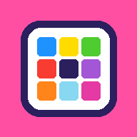
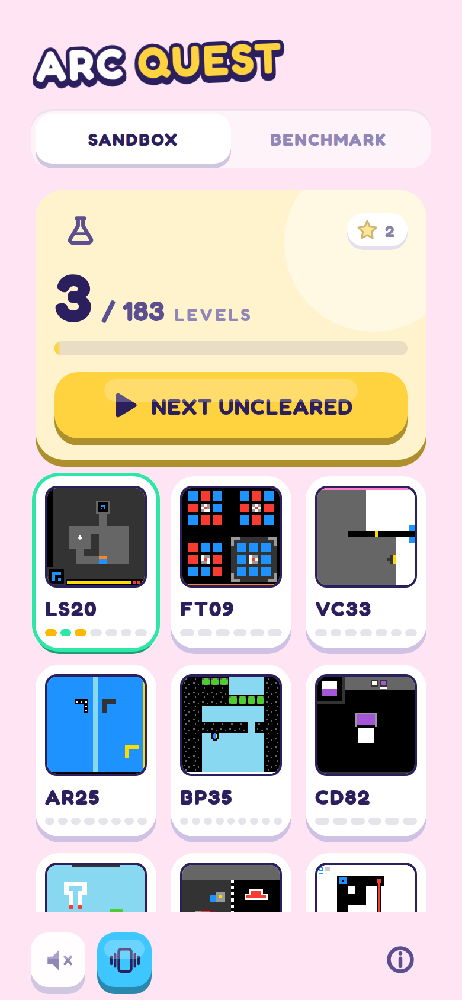
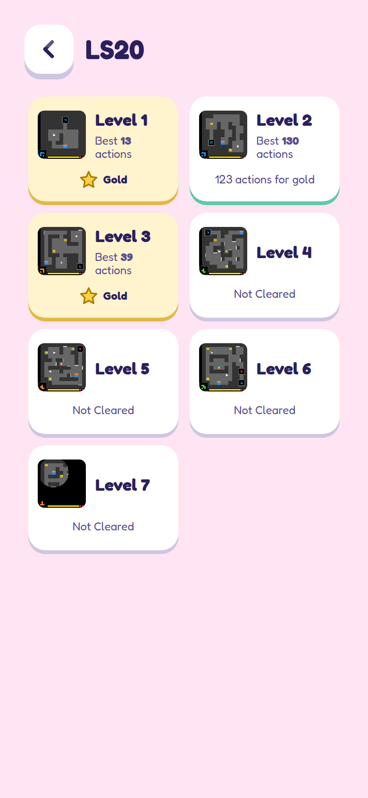
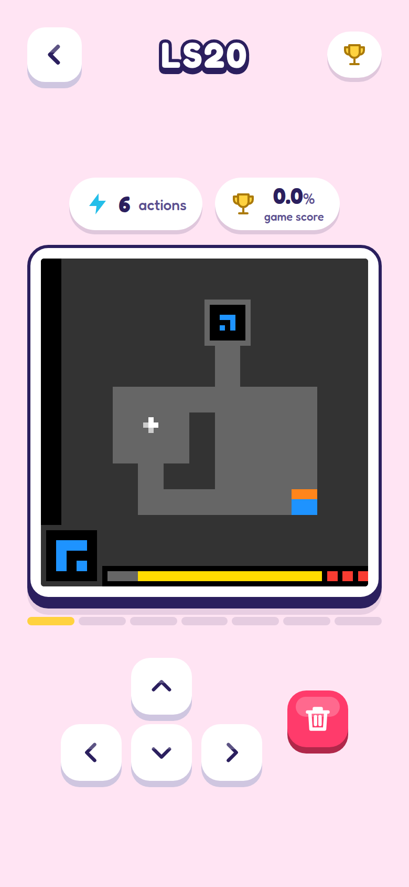
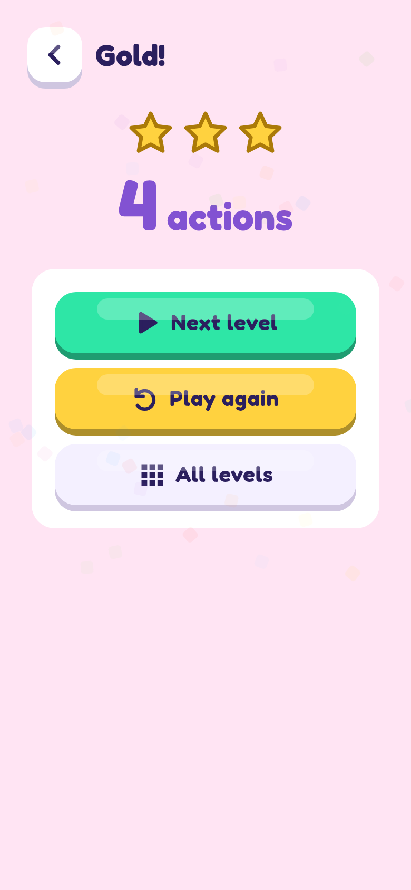
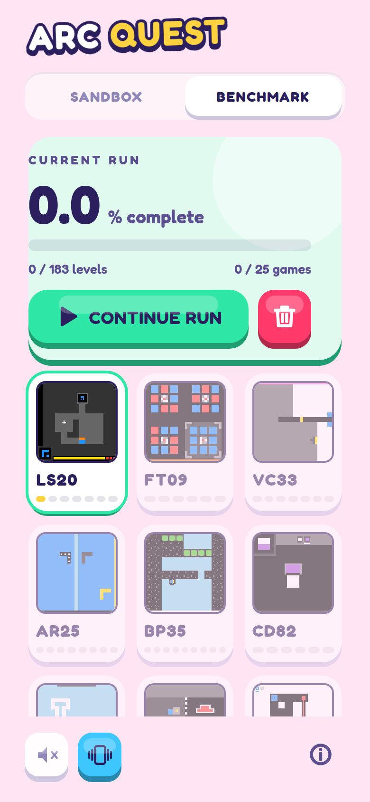
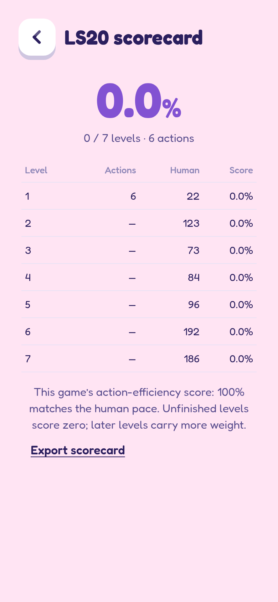
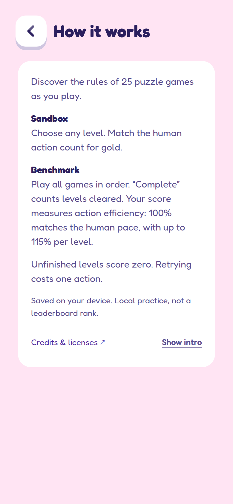
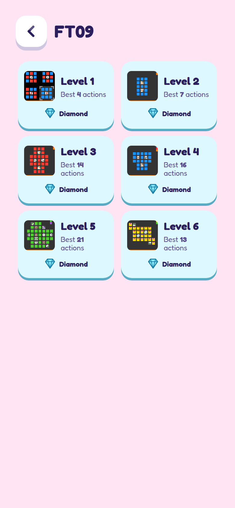

# ARC Quest

25 puzzle games. 183 levels. Figure out the rules as you go.

Play offline on Android or in your browser.

[Android APK](https://apps.muxu.click/d/a7wj7334) · [Web preview](https://apps.muxu.click/d/q92ci9g2)

## Screenshots

<p align="center">
  
  
  
  
</p>

<p align="center">
  
  
  
  
</p>

## Gameplay

- **Sandbox:** choose any level. Match the human action count for gold.
- **Benchmark:** play all 25 games in order. Every action counts.
- Tap the board, swipe, or use the buttons. Each game has its own controls.
- Earn gold everywhere to reveal diamonds for matching or beating public level records.

No account, ads or gameplay server. Progress stays on your device.

## Build

```sh
npm ci
npm run dev
```

Use `npm run build` for the web app or `scripts/build-android.sh` for the APK.

[Development](docs/DEVELOPMENT.md) · [Verification](VERIFICATION.md)

## Credits & licenses

Original games and engine by the [ARC Prize Foundation](https://arcprize.org/), under the [MIT license](public/licenses/ARC-MIT.txt). [Fredoka](public/licenses/Fredoka-OFL.txt) by Milena Brandão. Diamond records from [ARC3.Games](https://arc3.games/). Interface inspired by [Cube Run](https://github.com/Eve-146T/cube-run).

Scores are local practice results, not official leaderboard submissions.
