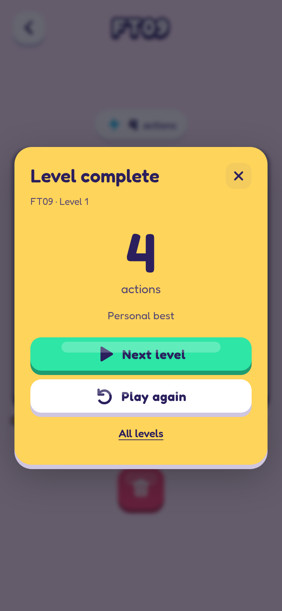

# ARC Quest

ARC AGI 3 but as a mobile game.

[Android APK](https://github.com/Eve-146T/arc-quest/releases/latest)

## Screenshots

  
  
  
  

## Credits & licenses

Original games and engine by the [ARC Prize Foundation](https://arcprize.org/), under the [MIT license](public/licenses/ARC-MIT.txt). [Fredoka](public/licenses/Fredoka-OFL.txt) by Milena Brandão. Diamond records from [ARC3.Games](https://arc3.games/).

ARC Quest is licensed under the [GNU Affero General Public License v3.0](LICENSE). Third-party components retain their own licenses.
